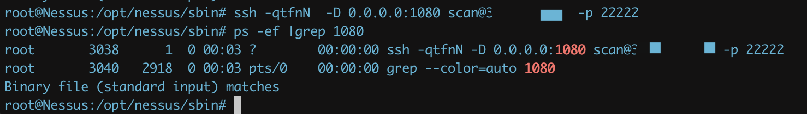
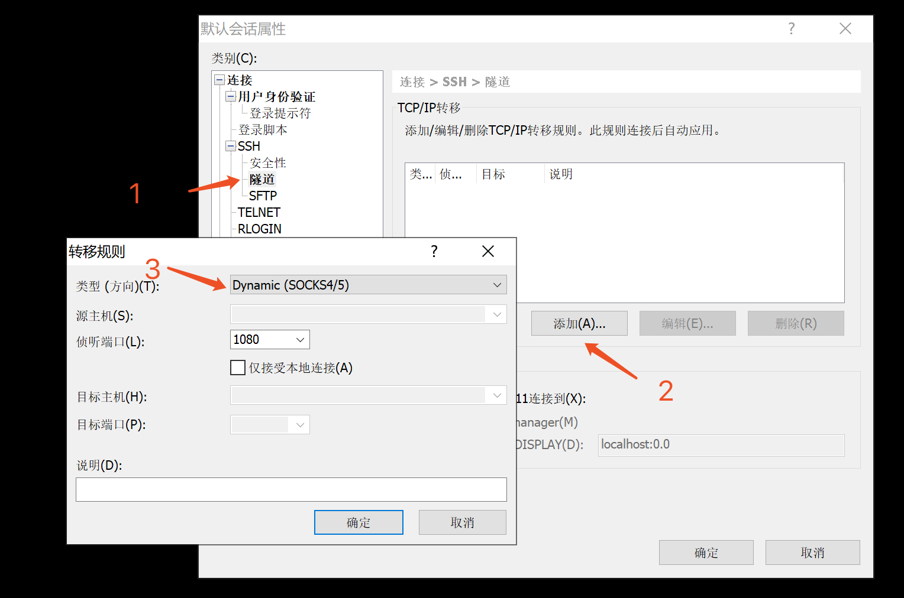
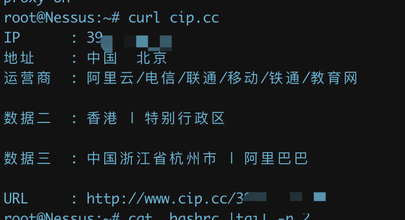

# 代理

代理总结，遇到一次加一次

## 0x00. ssh隧道代理

- shell

  参考

  <https://cloud.tencent.com/developer/article/1134323>

```bash
ssh -qtfnN  -D 0.0.0.0:1080 scan@10.10.10.10 -p 22222
# ssh -qtfnN -D ip_listening:port_listening user@agent_ip -p port
ps -ef |grep 1080
# 查看是否成功连接
```



- xshell



## 0x01 polipo(socks5->http)

主要功能是将socks5代理转换成http代理

安装

```bash
apt-get install polipo
```

配置

```
vim /etc/polipo/config
```


启动服务

```bash
polipo -c /etc/polipo/config
```

终端代理配置：

``` bash
vim ~/.bashrc
```

将下面添加到文件末尾：

```bash
alias setproxy="export http_proxy=http://127.0.0.1:8123;export https_proxy=https://127.0.0.1:8123;echo 'proxy on'"

alias unsetproxy="unset http_proxy;unset https_proxy;echo 'proxy off'"
```

启用代理:

```
setproxy
```



关闭代理:

```bash
unsetproxy
```

